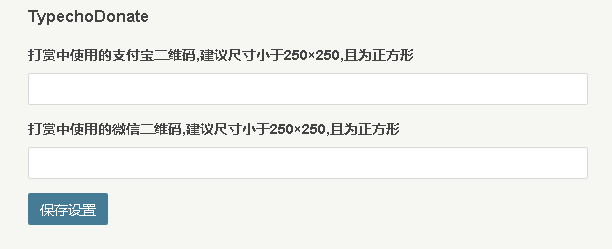

# TypechoDonate

为用户添加 `alipay` 和 `wxpay` 两个字段用户设置每个用户不同的打赏二维码地址



Handsome 主题可以修改 `usr/themes/handsome/component/Content.php` 第637行
代码 `if ($options->AlipayPic != null) {` 上面增加

```php
        $user = Typecho_Widget::widget('Widget_User');
        $user->execute();
        $options->AlipayPic = empty($user->alipay) ? $options->AlipayPic : $user->alipay;
        $options->WechatPic = empty($user->wxpay) ? $options->WechatPic : $user->wxpay;
```
